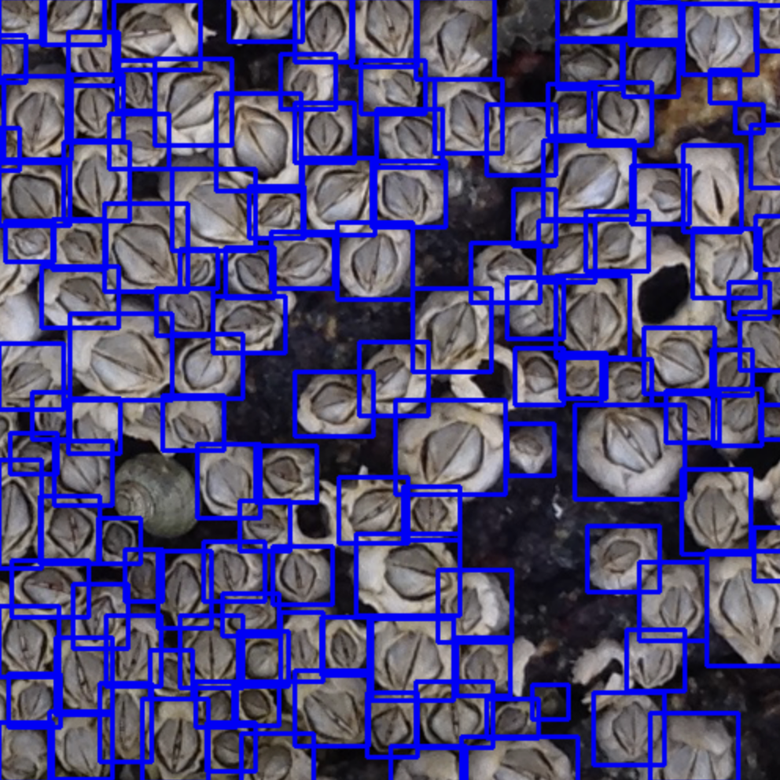
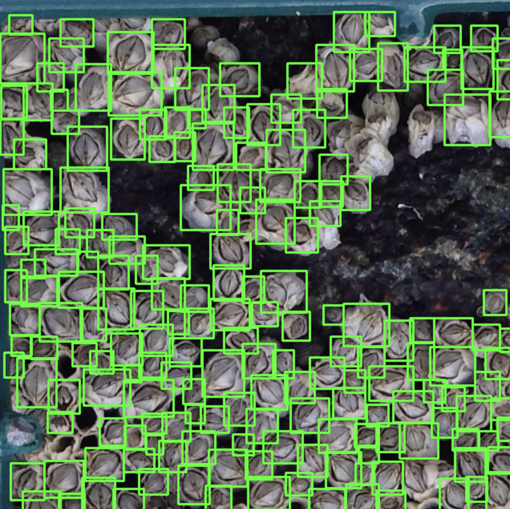
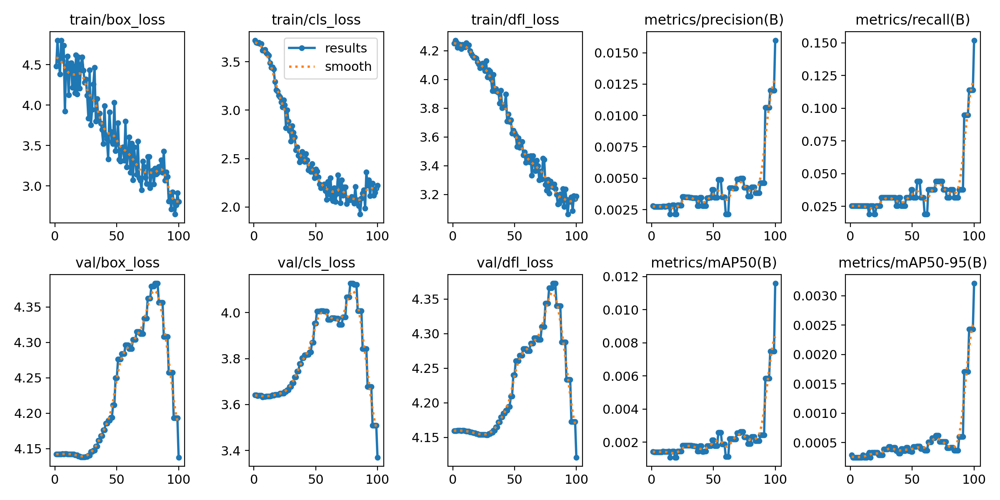
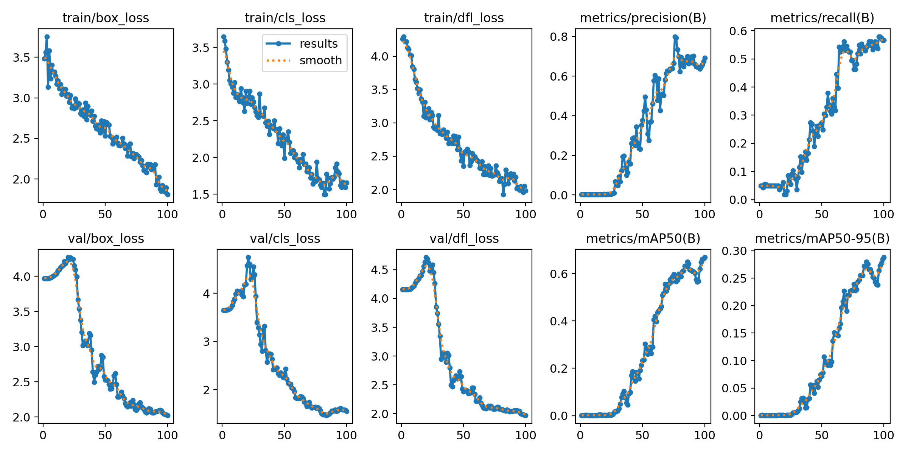
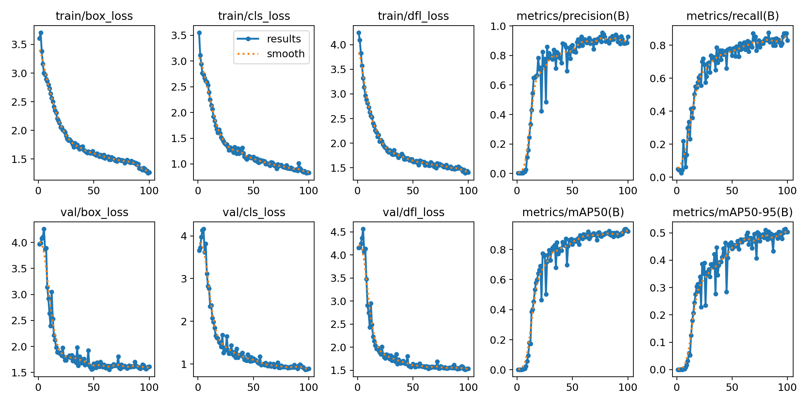
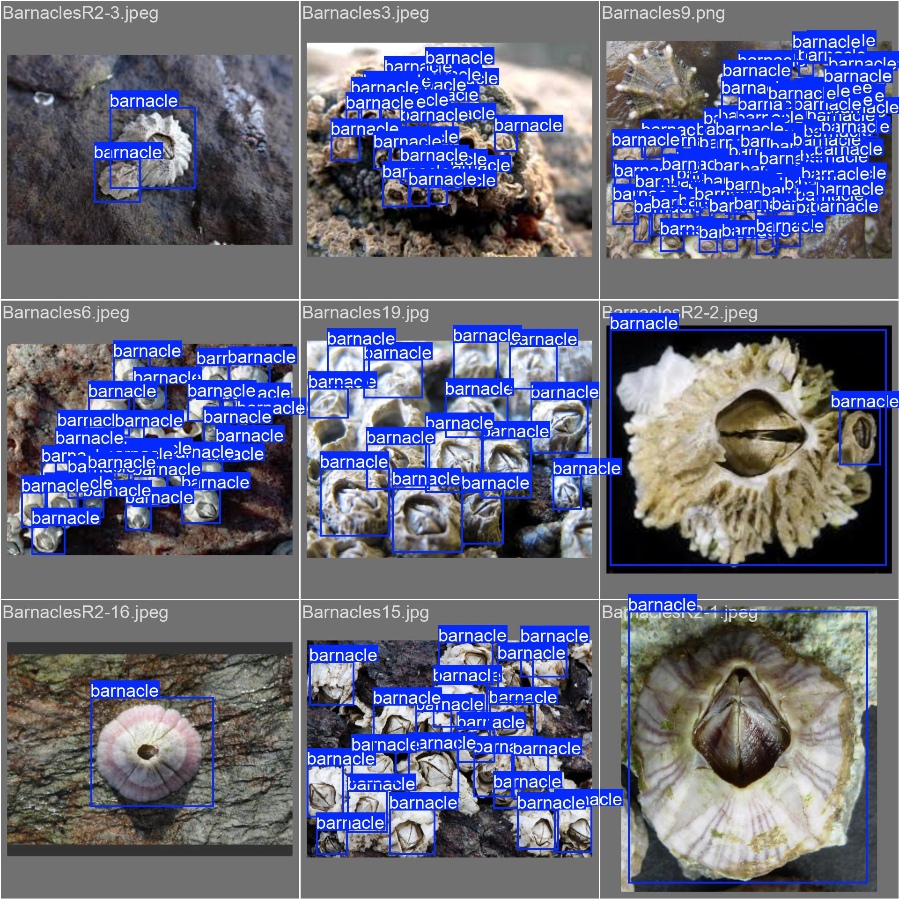
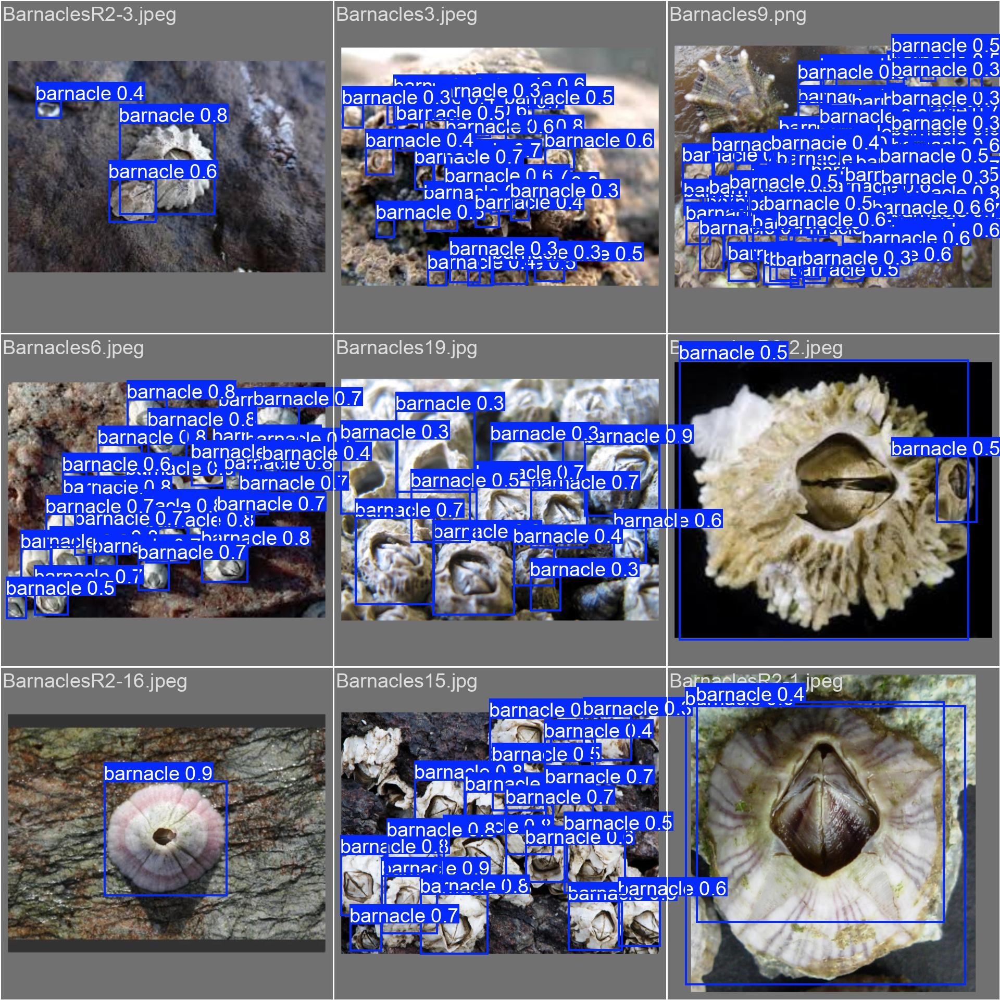

# **TRAINING A YOLOv8 MODEL TO DETECT BARNACLES**

By Evan Zhang

(All this information and more appears in the `YOLO-on-Barnacle-Detection/YOLO_on_Barnacle_Detection.ipynb` notebook)

I did my work in Google Colab since I don't have my own nvidia GPU, thus many of the path names in the notebook are relative to that and thus some things need to be put into the `/content` folder there

### **Best Model on the Given Unseen Images**

This is a quick visual of the results of the model which seemed to perform pretty well

The `best.pt` model being used on `unseen_img2.png` (In this image, were **135** barnacles detected by this model):



The `best.pt` model being used on a 640x640 pixel cropped portion of `unseen_img1.png`:

*This image shows proof-of-concept that larger images can STILL be counted by this YOLO model by cropping the image into smaller sections and summing them up*



### **What My Google Colab and Google Drive Structure Looked Like:**

If you want to replicate applying the model on the given barnacle images, put in the side files tab:

```
content/
    Barnacles_Images/   # folder with the given images (use the folder with the same name in this repo)
    best.pt             # the final model loaded (use the .pt file with the same name in this repo)
```

The path to my google drive folder looked like this (Root directory is called "YOLOv8"): `/content/gdrive/MyDrive/Coding/YOLOv8`

Inside of Google Drive, my folder (called "YOLOv8") had this structure:

```
data/
runs/
data.yaml
YOLO-on-Barnacle-Detection.ipnyb
```

You can just download the files in this repo and put them in that configuration.  The `data.yaml` file tells YOLO where to look to find the dataset with the training and validation images.  **YOU WILL LIKELY NEED TO CHANGE THE ROOT DIR PATH IN THIS FILE TO MATCH THE NAMES OF THE FOLDERS IN YOUR GOOGLE DRIVE**

## **Folder Information**

*   `Barnacles_Images/` hold the given images from the DALI Lab assignment
*   `data/` holds the training and validation images and labels that I annotated by hand using CVAT.  The labels have floating point values for where my annotated rectangles of Barnacles are at in the relative image
*   `runs/` a bunch of valuable information regarding my main 3 iterations of training the model to show my process.  If you want to look at or load a model from any of the runs, they are found in the `weights/` folder in each iteration
*   `best.pt` for convenience sake, I put the best performing model from the 3rd iteration at the root directory.  This is what I loaded in my notebook.
*   `results/` these images show up at the bottom of the notebook but I have them here so they can be displayed at the top of the README

### **Initial Ideas**

At first I wanted to learn a bit more about OpenCV and try to see if I could use those tools to somehow identify barnacles.  I watched a few tutorials and read up on the notation but it seemed that OpenCV did not have the best toolset to identify barnacles (stuff like Haar Cascades didn't seem super promising)

But the concept itself seemed very possible as barnacles (especially the acorn barnacles that seem to be in the given images) have a distinct appearance.  They have a shell indicated by a usually dark circle with a slit-like apperature in the middle.  Thus I thought that perhaps applying a state of the art detection model like
YOLO (You Only Look Once) **https://github.com/ultralytics/ultralytics** could work.

I referenced this github repo to learn about how to train YOLO for my own purpose: **https://github.com/roboflow/notebooks/blob/main/notebooks/train-yolov8-object-detection-on-custom-dataset.ipynb**

Specifically, I used the YOLOv8n detection model, which takes in 640x640 pixel images and is the smallest and least powerful version.  A detection model was bets for my task as I could count the number of detections in order to tally the amount of barnacles in an image.

## **Process**

I searched a lot of databases like kaggle and roboflow for existing datasets on barnacles but none really existed or were not annoted correctly for my task.  Thus, I used **https://app.cvat.ai/tasks** to annotate my own images.  I tried to follow a consistent annotation method of labeling as much of each barnacle as possible while using a variety of different barnacle images.

YOLOv8 uses a very particular input structure for its images and labels.  The way I formatted it was as follows:

```
data/
    images/
        train/    # training images
        val/      # images for validation
    labels/
        train/    # training labels (float values for where my annotations are)
        val/      # validation labels

data.yaml  # yaml file that directs where to find the training and validation
```

**More detailed information about the runs can be found in the `runs/` folder of this repo*

### **Iteration 1**

In my first iteration, I only used ~ 20 images in my training set which was a very small sample size.  Likewise, my image choice wasn't ideal which resulted in pretty terrible training results.  The loss of the model was decreasing over time but the confidence/precision in the `results.png` graph were pretty terrible sitting at **~ 0.0150** which meant the model was very unsure about what a barnacle was.



### **Iteration 2**

Obviously I needed a bit more data but I realized the main issue was that the images I was using to train were almost all of large clusters of barnacles.  Thus, I added a bunch of zoomed-in pictures of singular barnacles to aid the model's detection.

Also, since there aren't too many barnacle pictures on the internet, I augmented the data by also rotating it 90, 180, and 270 degrees, essentially quadrupling the amount of data to be trained on.  This ultimately resulted in ~ 80 images for this second training iteration.

The results were far far better with the model's confidence/precision reaching values of 0.6 - 0.7 (1.0 would be 100% confidence).  Looking at the `val_batch0_labels.jpg` and the `val_batch0_pred.jpg` the predicted labels in the latter were pretty good but some barnacles remained undetected so I knew I could do better.



### **Iteration 3 (Final)**

The main difference in this iteration was just manually adding and annotating hundreds of barnacle images to the dataset.  Once again, I rotated all the images to augment the data which now totalted the dataset to **250 images**.  This can be seen in the `/data` folder in the repository.  My logic was just that more data would lead to better detection which was proven true.

The results of this final iteration honestly surpassed my expectations as the confidence reached slightly above 0.8 and the `val_batch0_pred.jpg` prediction labels were also nearly perfect.



My Annotations:



Predicted:




### Conclusions can be found at the Bottom of the Python Notebook